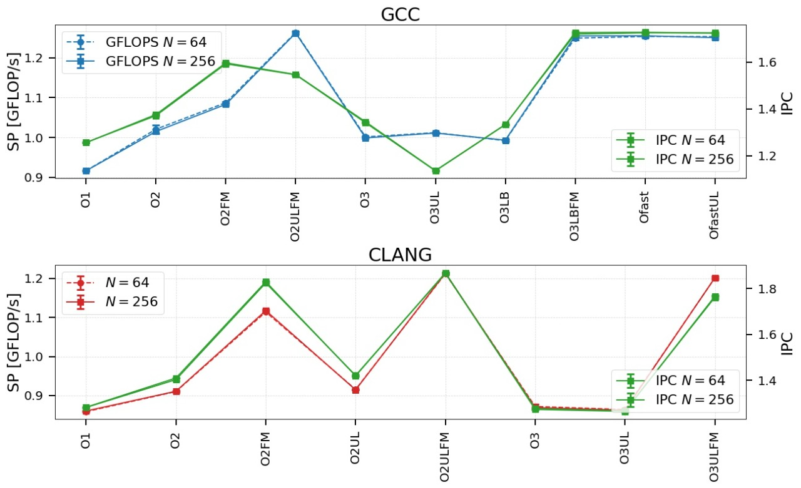
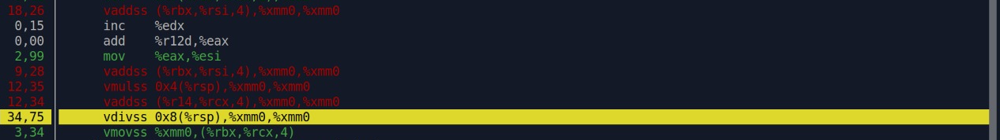
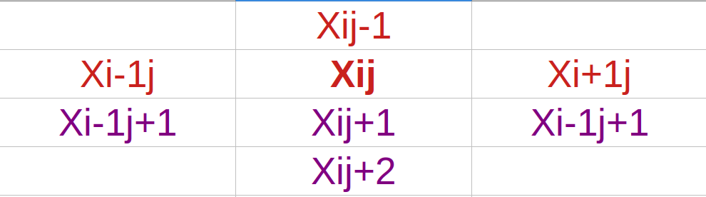
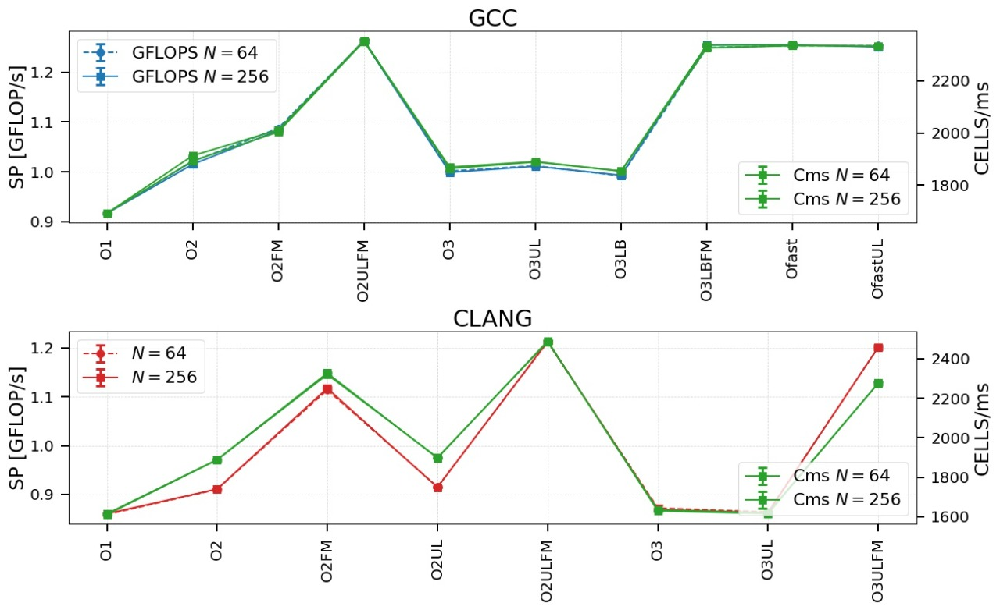
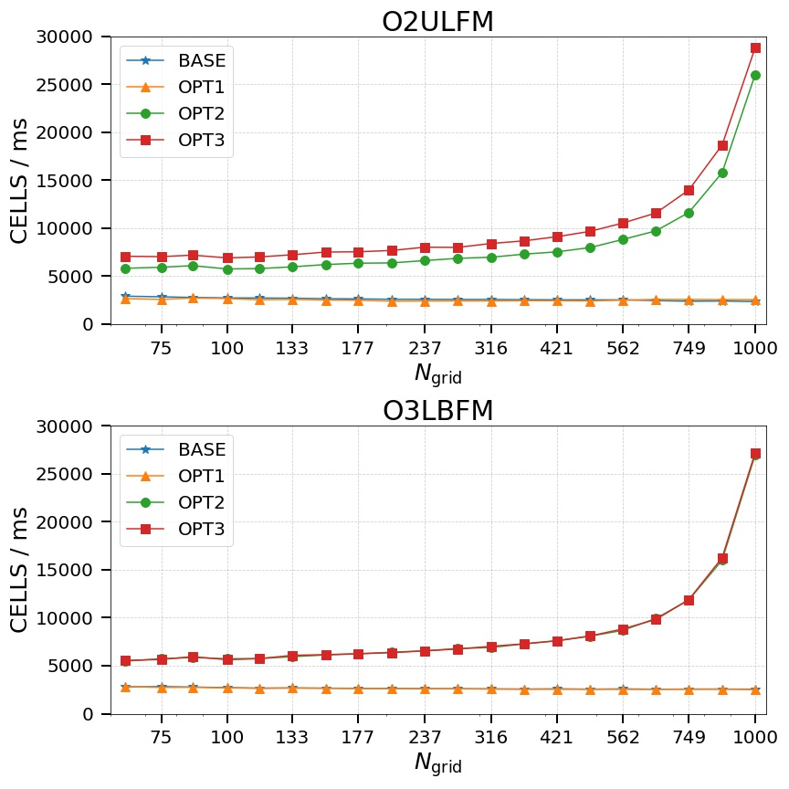

# Laboratorio 1 - Optimización secuencial

###### 15 de Abril de 2021

### Proyecto: Navier - Stokes

### Alumnos:
- Eduardo, Mario Gutierrez
- Stizza, Federico
  
---

# Hardware

**CPU:**

*Modelo:* Intel(R) Core(TM) i7-9750H CPU @ 2.60GHz
*Velocidad mín:* **800MHz**
*Velocidad máx:* **4500MHz**
*Ancho de banda máximo soportado:* **41.8 GB/s**

---
# Hardware (cont.)

**MEMORIA:**
| Tipo   | Tamaño | Ancho de banda (ERT) |
| ------ | ------ | -------------------- |
| *L1*   | 32kB   | 202.9 GB/s           |
| *L2*   | 256kB  | 166.6 GB/s           |
| *L3*   | 12MB   | 130.2 GB/s           |
| *DRAM* | 2x8GB   | 27.9 GB/s.           |
 
- *L1* se divide en *L1I*, *L1D* ambos de **32kB**.
---

# Benchmark ERT


---

# Software

**Sistema Operativo**
* *OS*: Ubuntu
* *Versión*: 20.04.2 LTS
* *Arquitectura*: x86_64

**Compiladores**
* *gcc* 9.3.0
* *clang* 10.0.0-4

---

# Medidas de rendimiento

- GFLOPs e IPC.

## likwid
Para realizar mediciones utilizamos la librería *likwid* que provee una interfaz para establecer regiones de conteo dentro del código.


--- 

# Flags

Estudiamos los resultados de compilar el código combinando distintas banderas de compilación y compiladores (*gcc* y *clang*)
* -O1
* -O2
* -O3
* -Ofast
* -march=native
* -ffast-math
* -funroll-loop

---

# Experimentos

Luego de implementar algunos scripts de automatización, experimentamos con las distintas banderas de compilación un total de 10 veces por compilación y tamaño. 

* Total: 18 combinaciones x 2 tamaños (64 y 256) x 10 veces = **360**.

---

# Resultados



---

# Conclusiones

Los resultados de los experimentos nos permiten concluir que las flags que más *exprimen* nuestro código **base** son las siguientes: 

* -O2, -march=native, -funroll-loops
* -O3, -march=native, -ffast-math
* -Ofast, -march=native


---
# Profiling

Utilizamos **perf 5.4.101** y encontramos que la función que más trabajo toma en la ejecución es *lin_solve*.


En particular la operación más cara es: 



---

# Optimizaciones

 La operación *vdivss* es la más cara por lo que optamos por cambiarla por su **inverso multiplicativo.**
```c
x[IX(i, j)] = (x0[IX(i, j)] + a * (x[IX(i - 1, j)] + 
x[IX(i + 1, j)] + x[IX(i, j - 1)] + x[IX(i, j + 1)])) / c // Original

float inv_c = 1.0f / c;

x[IX(i, j)] = (x0[IX(i, j)] + a * (x[IX(i - 1, j)] + 
x[IX(i + 1, j)] + x[IX(i, j - 1)] + x[IX(i, j + 1)])) * inv_c; // Optimizado
```

### En perf


Como vemos, la división fue intercambiada por la multiplicación bajando su costo.

---

# Optimizaciones (cont.)

**Criterio de convergencia.** El código original de la función *lin_solve* no utilizaba un criterio de convergencia claro.

* Medimos el error relativo con el que *convergía* originalmente y acotamos las iteraciones en base a ese error.

```c
float acum;
do {
    acum = 0.0f;
    for (unsigned int i = 1; i <= n; i++) 
        for (unsigned int j = 1; j <= n; j++) {
        x_new = (x0[IX(i, j)] + a * (x[IX(i - 1, j)] + x[IX(i + 1, j)] + x[IX(i, j - 1)] + x[IX(i, j + 1)])) * inv_c;    
        acum += ABS((x_new - x[IX(i, j)]) / x[IX(i, j)]);
        x[IX(i, j)] = x_new;
        }
    }
    acum = acum / (n * n);
    set_bnd(n, b, x);
} while (acum > 1e-1f); // Criterio de convergencia.
```

---
# Optimizaciones (cont.)

Por último observamos que el patrón de accesos a memoria utilizado por la función *lin_solve* nos permitía dar por sentado que se podría reutilizar alguno de los valores calculados. (en cada iteración, se reutiliza el valor de x_new).



La última optimización realizada consiste en calcular y reutilizar este valor en cada iteracion con **j > 1**.

---

# Cambio de métrica

El cambio del criterio de convergencia redujo considerablemente el tiempo de ejecución del programa. Al analizar los resultados con la métrica GFLOPs observamos que el programa supuestamente bajó su performance, pero la diferencia radica en que éste ahora realiza muchas menos operaciones.

Por lo que decidimos cambiar de métrica a celdas calculadas por micro segundo.

---

# Comparación de métricas



---

# Resultado optimizaciones



---
