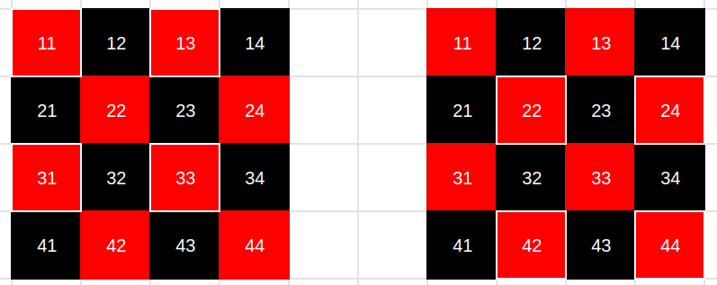

# Laboratorio 2 - Vectorización

###### 13 de Mayo de 2021

### Proyecto: Navier - Stokes

### Alumnos:
- Eduardo, Mario Gutierrez
- Stizza, Federico
  
---

# Resultados laboratorio 1


---

# Equilibrando el problema

La optimización del primer laboratorio que más performance aportó al problema fue la del cambio de criterio de convergencia de la función **lin_solve**. 

Como se puede ver en el gráfico anterior, para los tamaños de problema grandes, la performance es muy alta, esto se debe a que el problema original posee una sola fuente en el centro  y para tamaños grandes la mayor parte de las celdas no tienen valores para calcular y por el criterio antes mencionado la ejecución termina casi sin iterar.

Por lo tanto, decidimos agregar fuentes en distintas partes de la matriz, no solo en el centro para que la medida sea más real.

#### Con la única fuente

#### Con múltiples fuentes proporcional al tamaño de la matriz


* **64**: 4204.204465
* **256**: 18162.475285
* **512**: 15304.411334
* **1024**: 13653.243575

Podemos observar que la performance se mantiene estable para los tamaños pequeños y para el tamaño más grande baja, lo que creemos que es relativamente normal teniendo en cuenta que a mayor tamaño se agrega más cantidad de fuentes y por lo tanto tiene más carga que para los otros problemas.

Por lo que consideramos estos valores como la base de comparación.

# Autovectorización

Probamos de autovectorizar nuestro código con diferentes versiones de **clang** y **gcc**.

Aunque si autovectorizó algunos *loops*, no hizo ningún efecto en el loop principal de *lin_solve*, que es la función que más carga tiene en el programa.

##### Algunos mensajes obtenidos

* *cannot prove it is safe to reorder memory operations.*

* *could not determine number of loop iterations*

Guíandonos por los mensajes de reporte generado por los compiladores realizamos ciertos cambios para ayudar al compilador para que autovectorice:

- Le agregamos el modificador **restrict** a los punteros de la matriz, para evitar el aliasing de memoria.
- Reemplazamos las cotas de los *loops* por constantes.
- Cambiamos las condiciones de terminación de los *loops* en vez de ```<= n ``` a ``` < n + 1 ``` (sugerencia encontrada en un foro).
- Agregamos instrucciones de preprocesador como ```#pragma clang loop vectorize(enable)``` o ```#pragma ivdep```

A pesar de todo el esfuerzo no logramos que vectorice hasta que usamos la instrucción ```#pragma clang loop vectorize(assume_safety)``` la cual permite hacer reordenamiento de las direcciones de memoria.

Tanto *clang-9* como *clang-11* pudieron vectorizar, pero observando los resultados del **demo** concluimos que no eran correctos. Por lo que consideramos vectorizar explícitamente usando **ISPC**.

# Vectorización explícita (ISPC) 

### Estructura Red-Black

El primer paso fue encontrar una forma de independizar los cálculos de la mátriz para así poder hacerlos en *paralelo*. Siguiendo la propuesta del profesor, reacomodamos la mátriz de las celdas para que queden según la estructura **Red-Black**.


Se puede observar que el vector que antes representaba una matriz ahora queda separado en dos partes, una que contiene todas las casillas rojas y rosas y la otra parte que tiene las casillas negras y grises. 

Lo interesante de esta organización es que se pueden calcular los valores de las casillas rojas de manera independiente, consultando los valores de las casillas negras desactualizadas y viceversa.

Si bien, el algoritmo original itera sobre todas casillas actualizadas, este otro algoritmo que utiliza la versión anterior de los vecinos converge de manera similar.

Lo siguiente fue encontrar una ley para obtener los vecinos de una casilla, lo cual depende del color de la casilla y del indice que representa en la matriz original.

### Implementación

Implementamos en ispc la función **lin_solve** en *ISPC* de la siguiente manera:

```
    ...

    /// Rojos ; Impar - Impar
    for(uniform size_t i = 1; i < n-1; i+= 2)
    {
        uniform unsigned int base = (n * n / 2) + 1;
        foreach(idx = i * n/2 ...  (i+1) * n/2 - 1) 
        {
            x[idx] = (x0[idx] 
                + a * (x[idx - (n/2 + 1) + base]
                + x[idx + (n/2 - 1)+ base]
                + x[idx - 1 + base]
                + x[idx + base])) * inv_c;
            if(x[idx] > 1e-5f){
                cont++;         
                acum += abs(x[idx]-x0[idx]);
            }
        }
    }
    
    ...
```

Para una mejor visualización se omitieron otros tres bucles *for* similares.

En total son cuatro *loops* donde cada uno se encarga de calcular un rango de celdas. Los primeros dos calculan todas las celdas rojas. Y los últimos dos las negras.

El primero se calculan las celdas *impares impares* es decir las celdas cuyas componentes i,j de la matriz original son impares y el otro *for* luego todas las rojas con componentes *pares pares*. 



Por último se calculan las celdas negras que se subdividen en dos bucles, uno que calcula las que son *par impar* y el restante las que son de la forma *impar par*.

La verdadera *vectorización* se encuentra en las claúsulas **foreach** que recorren las filas establecidas de manera vectorial.

Además también implementamos el mismo criterio de convergencia que utilizamos en el primer de laboratorio.

# Resultados


Se puede observar que hay una gran mejora sobre todo para los tamaños grandes de casi un 75%. Aunque no sabemos porque el no vectorizado para el tamaño de 256x256 da tan similar al vectorizado y compilado con *GCC*.

Todos los programas fueron verificados con el **demo** y funcionan correctamente.