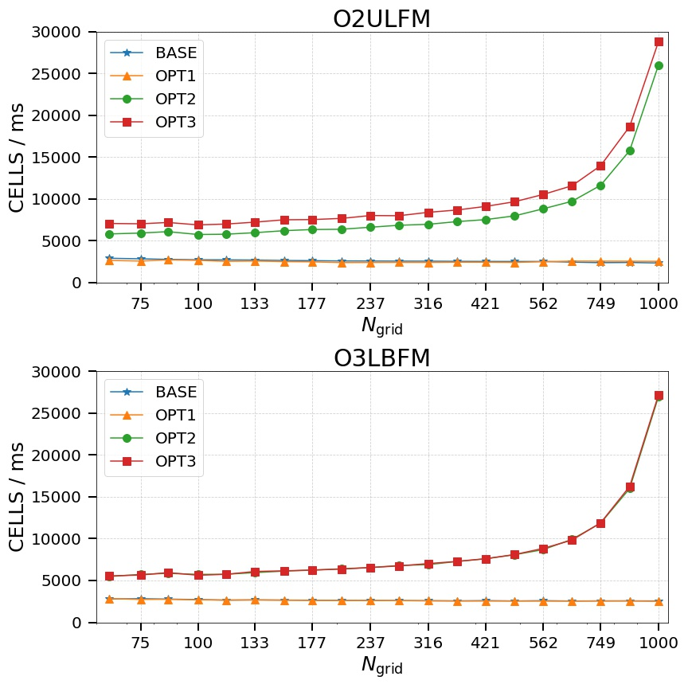
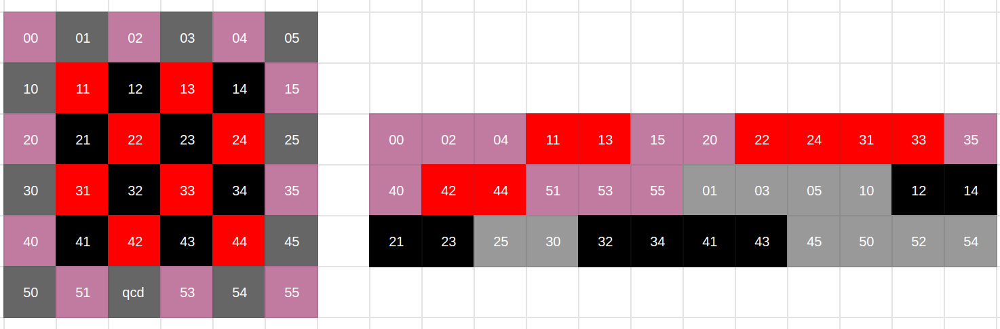

# Laboratorio 2 - Vectorización

###### 13 de Mayo de 2021

### Proyecto: Navier - Stokes

### Alumnos:
- Eduardo, Mario Gutierrez
- Stizza, Federico
  
---

# Resultados laboratorio 1



---
# Correciones al laboratorio 1

La optimización del primer laboratorio que más performance aportó al problema fue la del cambio de criterio de convergencia de la función **lin_solve**. 

Corregimos este criterio que antes no contemplaba que el denominador del error relativo fuera 0. Para esto lo reemplazamos por el error absoluto.

Además decidimos agregar fuentes en distintas partes de la matriz, no solo en el centro para que la medida sea más real.

--- 
# Nuevos resultados

Podemos observar que la performance se mantiene estable para los tamaños pequeños y para el tamaño más grande baja, lo que creemos que es relativamente normal teniendo en cuenta que a mayor tamaño se agrega más cantidad de fuentes y por lo tanto tiene más carga que para los otros problemas.

* **64**: 4204.204465 c/ms.
* **256**: 18162.475285 c/ms.
* **512**: 15304.411334 c/ms.
* **1024**: 13653.243575 c/ms.

Por lo que consideramos estos valores como la **base** de comparación.

--- 
# Autovectorización

Probamos de autovectorizar nuestro código con diferentes versiones de **clang** y **gcc**.

No hizo ningún efecto en el loop principal de *lin_solve*, que es la función que más carga tiene en el programa.


##### Algunos mensajes obtenidos

* *cannot prove it is safe to reorder memory operations.*

* *could not determine number of loop iterations*

---

# Ayudando al compilador

- **restrict**.
- Cotas de los *loops* constantes.
- Condiciones de terminación de los *loops* ```<= n ``` a ``` < n + 1 ```.
- Instrucciones de preprocesador como ```#pragma clang loop vectorize(enable)```, ```#pragma ivdep``` y ```#pragma clang loop vectorize(assume_safety)```.

Tanto *clang-9* como *clang-11* pudieron vectorizar con esta última instrucción pero los resultados del **demo** no eran correctos. 

--- 
# Vectorización explícita (ISPC) 
### Estructura Red-Black

El primer paso fue encontrar una forma de independizar los cálculos de la mátriz para así poder hacerlos en *paralelo*. Siguiendo la propuesta del profesor, reacomodamos la mátriz de las celdas para que queden según la estructura **Red-Black**.



---
### Implementación

Implementamos en ispc la función **lin_solve** en *ISPC* de la siguiente manera:

```
    ...

    /// Rojos ; Impar - Impar
    for(uniform size_t i = 1; i < n-1; i+= 2)
    {
        uniform unsigned int base = (n * n / 2) + 1;
        foreach(idx = i * n/2 ...  (i+1) * n/2 - 1) 
        {
            x[idx] = (x0[idx] 
                + a * (x[idx - (n/2 + 1) + base]
                + x[idx + (n/2 - 1)+ base]
                + x[idx - 1 + base]
                + x[idx + base])) * inv_c;
            if(x[idx] > 1e-5f){
                cont++;         
                acum += abs(x[idx]-x0[idx]);
            }
        }
    }
    
    ...
```

--- 

### Implementación (continuación)


La verdadera *vectorización* se encuentra en las claúsulas **foreach** que recorren las filas establecidas de manera vectorial.

---
# Resultados


Se puede observar que hay una gran mejora sobre todo para los tamaños grandes de casi un 75%. Aunque no sabemos porque el no vectorizado para el tamaño de 256x256 da tan similar al vectorizado y compilado con *GCC*.

Todos los programas fueron verificados con el **demo** y funcionan correctamente.