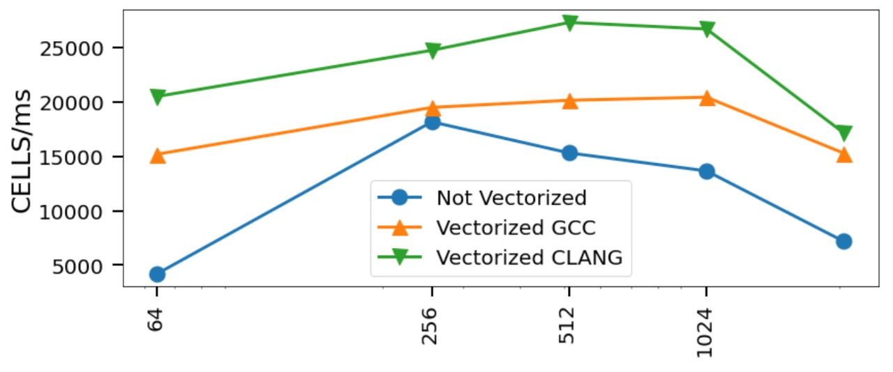
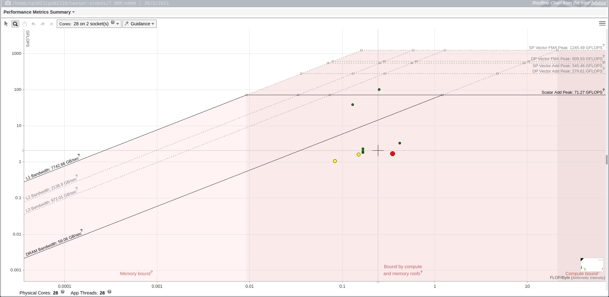

# Laboratorio 2 - Vectorización

###### 13 de Mayo de 2021

### Proyecto: Navier - Stokes

### Alumnos:
- Eduardo, Mario Gutierrez
- Stizza, Federico
  
---

# Resultados laboratorio 2



# Independencia de cálculo

En el laboratorio anterior reestructuramos la información de las celdas utilizando el ordenamiento *Red-Black*.

Nuevamente la función a optimizar sigue siendo *lin_solve* y por lo mencionado anteriormente el cálculo de las casillas rojas es independiente de las casillas negras.

# Paralelizando

En primer lugar, modificamos el código vectorial del laboratorio anterior para así llamarlo desde el *lin_solve* ya que el bucle **for** principal se encontraba dentro del código **ISPC**. 

```c
    unsigned int cont_ = 0;
    float acum_ = 0.0f;

    foreach(idx = offsetI + i * n/2 ...  offsetF +(i+1) * n/2) 
    {
        x[idx] = (x0[idx]
            + a * (x[idx - (n/2 - alpha) + base]
            + x[idx + (n/2 + alpha) + base]
            + x[idx + base + alpha]
            + x[idx + base])) * inv_c;
        if(abs(x[idx]) > 1e-10f){
            cont_ ++;         
            acum_ += abs(x[idx]-x0[idx]);
        }
    }

    *acum += reduce_add(acum_);
    *cont += reduce_add(cont_);
```

Se puede observar que el método se encuentra parametrizado para por *base*, *offsetI*, *offsetF* y *alpha* que determinan la parte de la matriz que está calculando e indexa los vecinos del color contrario.

Para este laboratorio decidimos hacer 2 tipos de pruebas: con y sin optimización del *criterio de convergencia*, pensamos que al limitarle el trabajo al método iterativo estamos limitando el poder de cómputo paralelo, sin el criterio se ignoran las lineas que inciden en el cálculo de *cont* y *acum*.

Por último, utilizando la libreria *OpenMP* agregamos a la función las directivas de los 4 bucles **for**:

```c
#pragma omp for reduction(+:cont, acum)
    for (size_t i = 2; i < n - 1; i += 2) lin_solve_single(n+2, i, base, offsetI, offsetF, &cont, &acum, alpha, x, x0, a, inv_c);
```

La única condición de sincronización que tuvimos que poner fue una barrera
```c
 #pragma omp barrier
```
 al final de los 4 bucles para evitar que se empiece a procesar una nueva vuelta del bucle principal y que trabaje con datos no actualizados o sobre-actualizados.

### Tipos de variables.

```c
#pragma omp parallel shared(x,x0, a, b, inv_c, n, contT, acumT) private(base, offsetI, offsetF, alpha) 
```

Como se puede observar en la claúsula anterior, declaramos las variables  *x, x0, a, b, inv_c, n, contT, acumT * como compartidas ya que x y x0 son las que se deben modificar en todos los hilos. Como está contemplado que cada iteración de los bucles escriben en sectores separados no hay corrupción de los datos.

Por último las variables *base, offsetI, offsetF, alpha* que parametrizan la ejecución vectorial, son privadas ya que no se modifican en la ejecución.

### Resultados 


### Resultados con criterio de convergencia


Se puede observar que ambos tienen un comportamiento similar, en el caso de la implementación del criterio de convergencia los valores son un poco más altos pero en ambos se presenta una ligera caída al utilizar el máximo de cores. Este comportamiento se debe al conocido *trade-off* que existe en la parelelización, donde participa la eficiencia del código ejecutado paralelamente y el costo de abrir hilos paralelamente.

# Roofline del programa



Por último realizamos el análisis *roofline* con la herramiente *Intel Advisor*, donde podemos observar que nuestra implementación realiza muchos accesos a memoria *L3* y *DRAM* lo cual se debe al ordenamiento *Red-Black* de la matriz.

Un punto a favor es que entre las funciones que el roofline nos sugiere optimizar no se encuentra *lin_solve* que fue donde focalizamos nuestro trabajo.