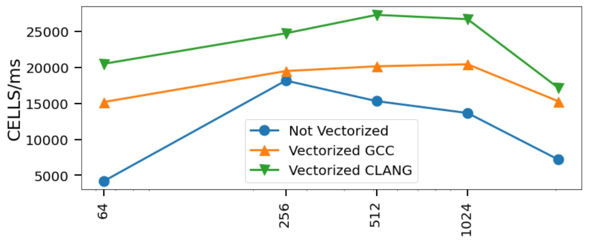

# Laboratorio 3 - Paralelización

###### 28 de Mayo de 2021

### Proyecto: Navier - Stokes

### Alumnos:
- Gutierrez, Eduardo Mario 
- Stizza, Federico
  
---

# Resultados laboratorio 2



---

# Independencia de cálculo

En el laboratorio anterior reestructuramos la información de las celdas utilizando el ordenamiento *Red-Black*.

---

# Paralelizando

```c
    unsigned int cont_ = 0;
    float acum_ = 0.0f;

    foreach(idx = offsetI + i * n/2 ...  offsetF +(i+1) * n/2) 
    {
        x[idx] = (x0[idx]
            + a * (x[idx - (n/2 - alpha) + base]
            + x[idx + (n/2 + alpha) + base]
            + x[idx + base + alpha]
            + x[idx + base])) * inv_c;
        if(abs(x[idx]) > 1e-10f){
            cont_ ++;         
            acum_ += abs(x[idx]-x0[idx]);
        }
    }

    *acum += reduce_add(acum_);
    *cont += reduce_add(cont_);
```

---

# Paralelizando (cont.)

```c
#pragma omp for reduction(+:cont, acum)
    for (size_t i = 2; i < n - 1; i += 2)
        lin_solve_single(n+2, i, base, offsetI, offsetF, &cont, &acum, alpha, x, x0, a, inv_c);
```

*Condición de sincronización*
```c
 #pragma omp barrier
```

---

# Resultados (sin crit. convergencia)


---

<!-- # Resultados (sin crit. convergencia)


--- -->
<!-- 
# Resultados (con crit. convergencia)


--- -->

# Resultados (con crit. convergencia)


---

# Roofline del programa

