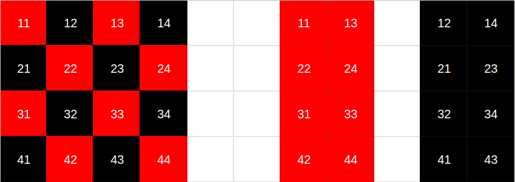

# Laboratorio 4 - Paralelismo en GPU

##### 22 de Junio de 2021

### Proyecto: *Navier-Stokes*

### Alumnos:
- Eduardo, Mario Gutierrez
- Stizza, Federico
  
---

# Resultados laboratorio 3

Presentamos los resultados del laboratorio anterior haciendo incapié en que estos resultados tienen un poco de ruido al cuál no pudimos encontrarle explicación.


# "Cudificando" el proyecto

En los otros laboratorios utilizamos los distintos niveles de paralelismo para mejorar la performance de la función más *pesada* de nuestro programa.

En cambio en este caso decidimos migrar todo el proyecto a **CUDA** con el objetivo de minimizar la transferencia de memoria entre *CPU* y *GPU*.

Identificamos en las funciones *advect* y *react* si había dependencia entre los datos, al no ser así pudimos paralelizar todas estas funciones *trivialmente* y por último decidimos trabajar en la función *lin_solve*.

# Lanzando cuda threads

Investigamos dos posibles distribuciones de hilos para nuestro problema:

* Grilla de una dimensión donde cada hilo calcula toda la fila de la matriz roja o negra.

```c
dim3 block(BLOCK_SIZE);
dim3 grid(div_ceil(n, block.x));
```

* Grilla de dos dimensiones donde cada hilo calcula una única casilla.

```c++

dim3 block(RB_BLOCK, RB_BLOCK / 2);
dim3 grid(div_ceil(n, block.x), div_ceil(n/2, block.y));

```

Los mejores resultados se obtuvieron con la última opción.

# Implementación de *lin_solve*

Al igual que en los laboratorios anteriores, la matriz de datos tiene la estructura RedBlack como se visualiza en el ejemplo a la izquierda.



De esta manera se deben calcular todas las casillas rojas primero y luego las negras, por lo que el lanzamiento de hilos 2D para el cálculo de lin solve fue como la que se visualiza en la parte derecha.

La implementación en sí fue bastante sencilla dado que solo se tuvo que mapear de la matriz de hilos lanzadas a la matriz original y de ahí utilizar dichos indices en la función `IX(i,j)` para obtener el indice en el vector lineal.

# Tamaños de bloque

Además de distintas organizaciones de hilos se probaron diferentes tamaños de bloques para obtener la mejor combinación.

| BLOCK_SIZE | RB_BLOCK |
| ---------- | -------- |
| 128        | 32       |
| 256        | 32       |
| 512        | 32       |
| 1024       | 32       |
| 128        | 16       |
| 256        | 16       |
| 512        | 16       |
| 1024       | 16       |

Donde **BLOCK_SIZE** define el tamaño para las grillas unidimensionales y **RB_BLOCK** define el tamaño para las grillas bidimensionales (utilizado en lin_solve).

Estas distintas combinaciones no generaron mucha diferencia en los resultados finales.
# Resultados


Podemos observar que los resultados mejoraron notablemente ante los obtenidos en el laboratorio anterior.

Nuevamente en el tamaño de grilla más grande calculado **4096** podemos ver que la performance decae y probablemente esto ocurra dado que el vector de casillas rojas y negras se encuentran en memoria contigua y cada vez que hay que calcular los vecinos negros en función de los rojos y viceversa se limpian cada vez más rápido las lineas de cache.

# Roofline del programa

Realizamos el roofline del programa con la configuración que mejores resultados obtuvimos:

* **BLOCK_SIZE**: 1024 
* **RB_BLOCK**: 16


Podemos ver que nuestro programa está trabajando casi al límite del roofline de *single presicion*, lo cual es bueno aunque también en las recomendaciones el profiler nos dice que nuestros kernels no tienen un buen *througput*. Así que habría que encontrar la forma de aumentar la cantidad de cálculos que realizan.

# Posibles mejoras

En el primer laboratorio realizamos una implementación que mejora el criterio de convergencia del método iterativo que realiza *lin_solve*, esto es calculado utilizando acumuladores de error relativo.

Pero esto conlleva a tener que realizar reducciones para obtener estos valores. Es un trade-off interesante para analizar dado que quizás combinando esta optimización mencionada junto a la distribución de hilos unidimensional mencionada anteriormente se obtienen mejores resultados.

# Conclusiones

Gracias a la estructura del problema se pudo aprovechar los recursos de la GPU ya que casi todas las funciones se pueden implementar de manera paralela lo que explica la mejora de más del 100% en casi todos los tamaños del problema.

