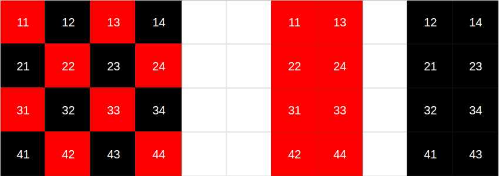

# Laboratorio 4 - Paralelismo en GPU

##### 22 de Junio de 2021

### Proyecto: *Navier-Stokes*

### Alumnos:
- Eduardo, Mario Gutierrez
- Stizza, Federico
  
---

# Resultados laboratorio 3


(resultados ruidosos, en PC local ~25.000)

---

# "Cudificando" el proyecto

* *advect*
* *react*
* *diffuse*
* *lin_solve*

En cambio en este caso decidimos migrar todo el proyecto a **CUDA** con el objetivo de minimizar la transferencia de memoria entre *CPU* y *GPU*.

---

# Lanzando cuda threads

* Grilla 1D

```c
dim3 block(BLOCK_SIZE);
dim3 grid(div_ceil(n, block.x));
```

* Grilla 2D

```c++

dim3 block(RB_BLOCK, RB_BLOCK / 2);
dim3 grid(div_ceil(n, block.x), div_ceil(n/2, block.y));

```

Los mejores resultados se obtuvieron con la última opción.

---

# Implementación de *lin_solve*



* Objetivo: mapear de las matrices rojas y negras a la original.
---

# Tamaños de bloque

Además de distintas organizaciones de hilos se probaron diferentes tamaños de bloques para obtener la mejor combinación.

| BLOCK_SIZE | RB_BLOCK |
| ---------- | -------- |
| 128        | 32       |
| 256        | 32       |
| 512        | 32       |
| 1024       | 32       |
| 128        | 16       |
| 256        | 16       |
| 512        | 16       |
| 1024       | 16       |


---
# Resultados


---
# Roofline del programa

Realizamos el roofline del programa con la configuración que mejores resultados obtuvimos:

* **BLOCK_SIZE**: 1024 
* **RB_BLOCK**: 16


---

# Roofline del programa (cont.)


---

# Posibles mejoras

* Optimización del criterio de convergencia.

* Utilizar los comentarios de roofline para ajustar los schedule de lanzamientos de hilos y los *sizes*.

* Combinar reducciones con kernels que trabajan muchos datos consecutivos.
---
# Conclusiones

Gracias a la estructura del problema se pudo aprovechar los recursos de la GPU ya que casi todas las funciones se pueden implementar de manera paralela lo que explica la mejora de más del 100% en casi todos los tamaños del problema.

